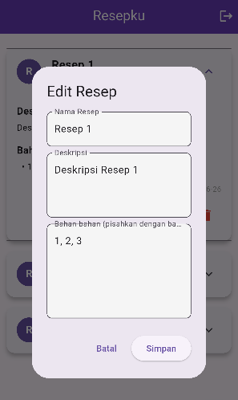

# uas_c14200114

Simple Recipe Keeper App (Supabase Version)
Aplikasi Flutter sederhana untuk menyimpan dan mengelola resep masakan pribadi, menggunakan Supabase untuk backend.

Fitur Aplikasi

Autentikasi Pengguna:

Sign Up: Pendaftaran akun baru menggunakan email asli dan kata sandi(terserah tidak menggunakan yang sama dengan akun email) melalui Supabase Auth.

Login: Login ke akun yang sudah terdaftar menggunakan Supabase Auth.

Sign Out: Keluar dari akun menggunakan button di kanan atas.

Penyimpanan Data Resep:
Menyimpan resep klik button plus(+) kemudian isi resep(nama, deskripsi, bahan-bahan) ke Supabase Database (PostgreSQL).
Setiap resep terhubung dengan UID pengguna yang login melalui kolom user_id.
Tampilan daftar resep yang tersimpan dengan real-time update.
Edit resep dengan klik button panah bawah kemudian klik button pencil warna biru.
Fungsionalitas hapus resep klik button panah bawah untuk membuka detail kemudian klik button trash can warna merah.

Persistensi Sesi Login:
Supabase Flutter secara otomatis menangani persistensi sesi login.

Get Started Screen (Halaman Pengantar):
Halaman selamat datang yang hanya muncul sekali saat aplikasi pertama kali diinstal (menggunakan shared_preferences).
Setelah pertama kali dibuka, aplikasi akan langsung menuju halaman login atau halaman utama jika sudah login.

Tool yang Digunakan
Flutter: Framework UI untuk membangun aplikasi multi-platform.
Supabase: Backend-as-a-Service (BaaS) open-source yang menyediakan:
Supabase Auth: Untuk manajemen autentikasi pengguna.
Supabase Database (PostgreSQL): Database relasional untuk menyimpan data resep.
Shared Preferences: Untuk menyimpan data sederhana (misalnya, status hasRunBefore untuk Get Started Screen).

Langkah Install dan Build
Klon Repositori (Jika ini repositori GitHub):
git clone <URL_REPOSITORI>
cd nama_file

Tambahkan Dependencies:
Pastikan Anda memiliki Flutter SDK yang terinstal. Jalankan perintah ini di direktori proyek:
flutter pub get

Konfigurasi Supabase:
Aplikasi ini menggunakan Supabase. Anda perlu mengatur database Supabase sendiri:
Buka Supabase Console.
Buat proyek baru.
Setelah proyek dibuat, salin Project URL dan Anon Key Anda dari Project Settings > API.
Tempelkan URL dan Anon Key ini di lib/main.dart pada baris url: 'YOUR_SUPABASE_URL' dan anonKey: 'YOUR_SUPABASE_ANON_KEY'.

Konfigurasi Database (recipes table):
Di Supabase dashboard, navigasikan ke Table Editor.
Buat tabel baru dengan nama recipes (schema public).

Tambahkan kolom-kolom berikut:
id: uuid (Primary Key, Default Value: gen_random_uuid())
user_id: uuid (untuk mengaitkan resep dengan pengguna, opsional bisa diatur sebagai Foreign Key ke auth.users (id))
name: text
description: text
ingredients: text[] (array of text)
created_at: timestamp with time zone (Default Value: now())
Aktifkan Row Level Security (RLS) untuk tabel recipes.

Buat Policy RLS:
SELECT Policy:
Name: Enable read access for users based on user_id
Target Roles: anon, authenticated
Permissive: SELECT
Using expression: auth.uid() = user_id
INSERT Policy:
Name: Enable write access for users based on user_id
Target Roles: anon, authenticated
Permissive: INSERT
Using expression: auth.uid() = user_id

UPDATE Policy:
Name: Enable update access for users based on user_id
Target Roles: anon, authenticated
Permissive: UPDATE
Using expression: auth.uid() = user_id

DELETE Policy:
Name: Enable delete access for users based on user_id
Target Roles: anon, authenticated
Permissive: DELETE
Using expression: auth.uid() = user_id

Aktifkan Email Authentication:
Di Supabase dashboard, navigasikan ke Authentication > Settings.
Di bawah Authentication providers, pastikan Email diaktifkan.
Jalankan Aplikasi